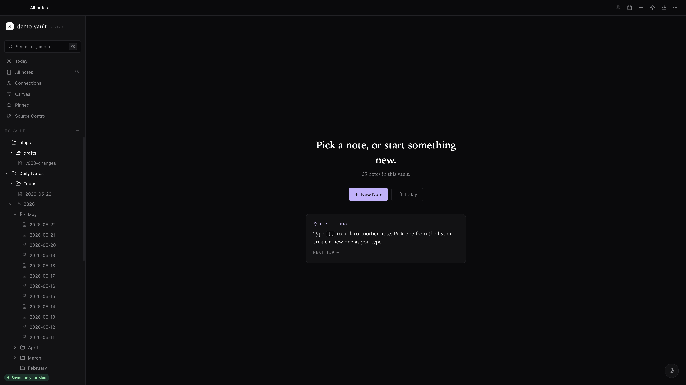
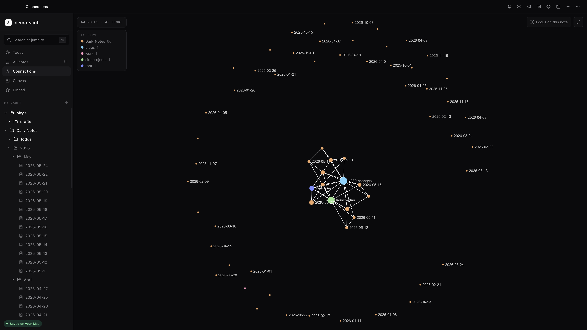
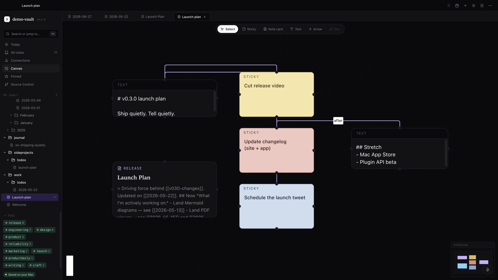
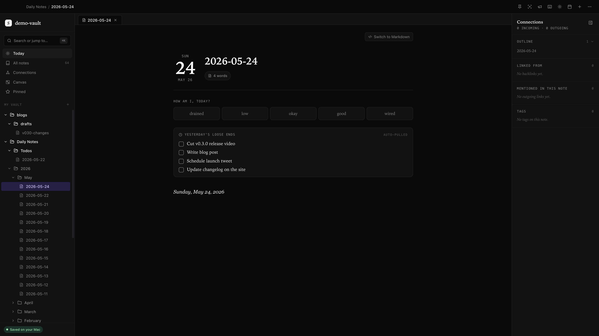
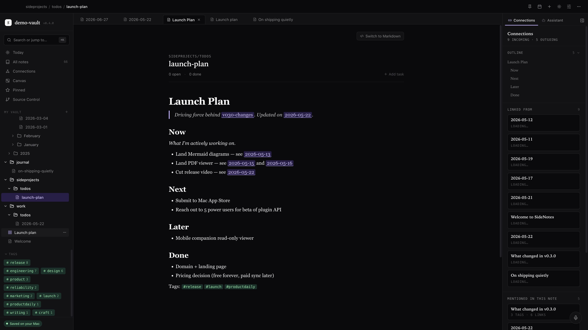
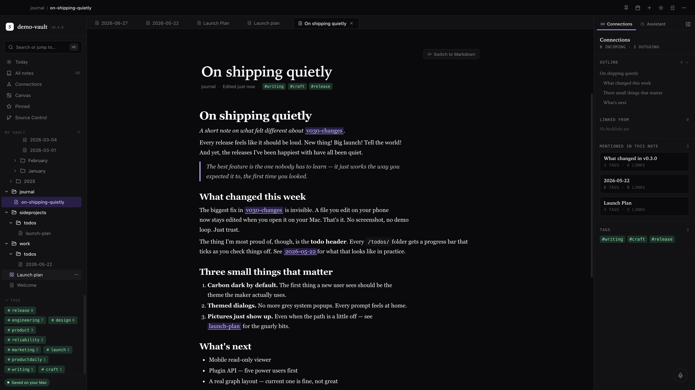
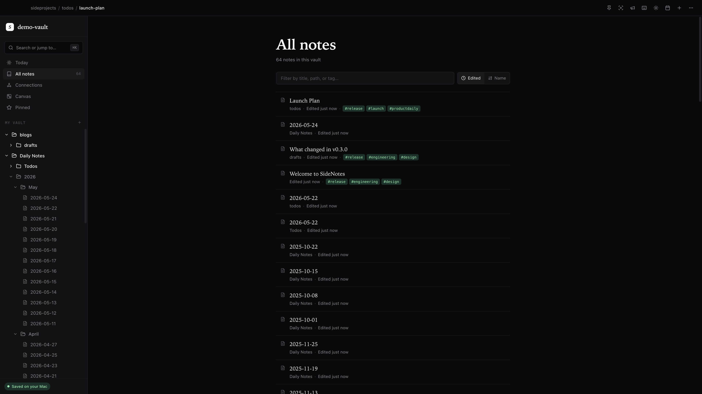
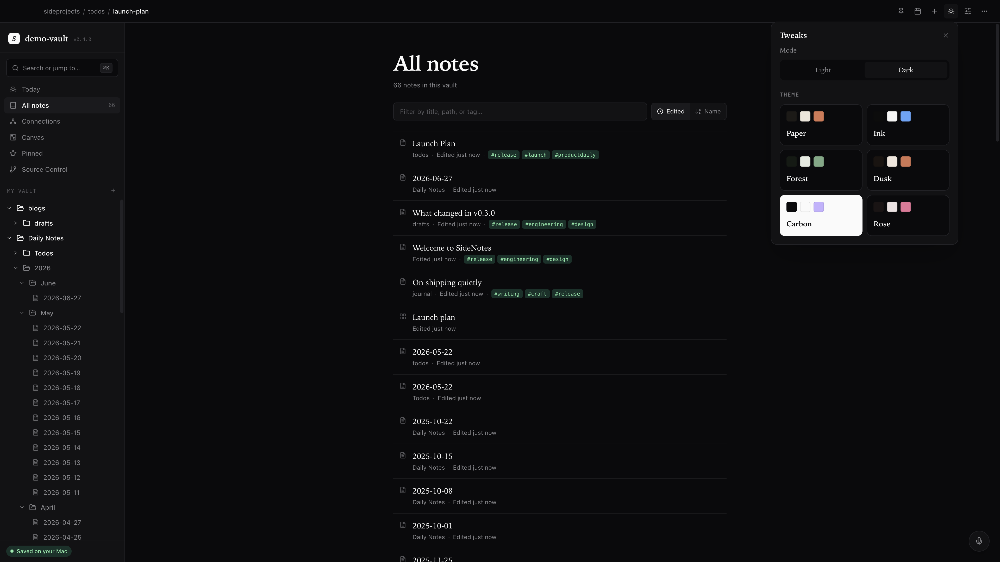
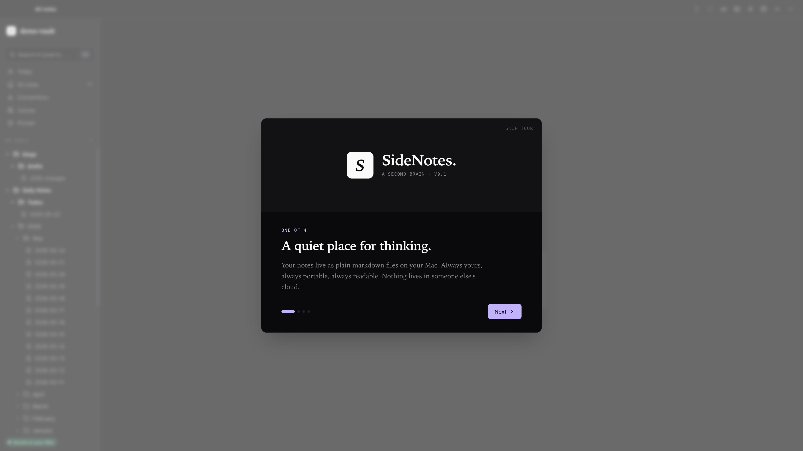

<div align="center">

# SideNotes

**A quiet, local‑first second brain.**
Notion‑easy editor. Obsidian‑deep linking. Notes stay as plain markdown files on your Mac — no cloud, no account, no lock‑in.

<br />



</div>

<br />

## Highlights

- **Block editor** — TipTap with a slash menu, drag handles, code blocks with syntax highlighting, and image paste/drop. Saves as plain markdown on every keystroke.
- **Tables that actually grow** — insert a 3×3 from the slash menu, then click any cell for a floating toolbar to add/remove rows or columns, toggle the header row, or delete the table. Drag column borders to resize.
- **Markdown source view** — one‑click switch in the top right of any note flips between rendered preview and the raw markdown source, so power users can edit the file directly without leaving the app.
- **Wikilinks & mentions** — type `[[` for note autocomplete, `@` for a unified picker (notes, tags, dates), `#` for tags. Backlinks panel always visible.
- **Connections graph** — Sigma + WebGL graph of every wikilink in your vault, coloured by folder, with hover highlighting and a "Focus on this note" mode that hides everything except the active note's neighborhood.
- **Canvas** — React Flow whiteboard for spatial thinking. Drag notes from the sidebar to embed them as live cards. Cards are freely resizable from any corner. Saves as `.canvas` JSON (Obsidian‑compatible).
- **Daily notes** — date masthead, mood strip, "yesterday's loose ends" auto‑pulled from the previous day. ⌘D opens today.
- **Six themes** — Paper, Ink, Forest, Dusk, Carbon, Rose. Each in light + dark. CSS‑variable driven so the editor, graph, and canvas all change at once.
- **Local‑first** — your vault is just a folder of `.md` files. Move it to iCloud Drive, Dropbox, or Syncthing for sync. The app doesn't run a sync service.
- **Onboarding tour, daily tips, full shortcuts cheatsheet** — opens on first launch and any time after via ⌘K or ⌘/.
- **Export** — PDF (via Electron's print engine), HTML, or plain markdown.

<br />

## A look around

<table>
  <tr>
    <td width="50%" valign="top">
      <a href="remotion/public/shots/raw/06-graph.png">
        
      </a>
      <p><strong>Connections graph</strong><br/>Every wikilink in your vault, drawn as a Sigma + WebGL graph. Coloured by folder, with hover highlighting and a focus mode for one note's neighborhood.</p>
    </td>
    <td width="50%" valign="top">
      <a href="remotion/public/shots/raw/12-canvas.png">
        
      </a>
      <p><strong>Canvas</strong><br/>React Flow whiteboard with sticky cards, text blocks, and live note embeds. Drag from the sidebar to drop a note on the board. Saves as Obsidian‑compatible <code>.canvas</code> JSON.</p>
    </td>
  </tr>
  <tr>
    <td width="50%" valign="top">
      <a href="remotion/public/shots/raw/02-daily.png">
        
      </a>
      <p><strong>Daily notes</strong><br/>A date masthead, a mood strip, and "yesterday's loose ends" auto‑pulled from the previous day so unfinished todos roll forward.</p>
    </td>
    <td width="50%" valign="top">
      <a href="remotion/public/shots/raw/14-todo-project.png">
        
      </a>
      <p><strong>Project todos</strong><br/>Any note can be a todo list. Open / done counters, a progress bar, and a backlinks rail down the right side.</p>
    </td>
  </tr>
  <tr>
    <td width="50%" valign="top">
      <a href="remotion/public/shots/raw/13-journal.png">
        
      </a>
      <p><strong>Long‑form writing</strong><br/>The same TipTap editor scales from a one‑line capture to a full essay. Tags inline, backlinks alongside, a clean reading column down the middle.</p>
    </td>
    <td width="50%" valign="top">
      <a href="remotion/public/shots/raw/08-allnotes.png">
        
      </a>
      <p><strong>All notes</strong><br/>Filter by title, path, or tag. Sort by edited or name. Tags render as coloured chips so you can scan a vault at a glance.</p>
    </td>
  </tr>
  <tr>
    <td width="50%" valign="top">
      <a href="remotion/public/shots/raw/11-theme.png">
        
      </a>
      <p><strong>Six themes, light + dark</strong><br/>Paper, Ink, Forest, Dusk, Carbon, Rose. CSS‑variable driven so the editor, graph, and canvas all repaint together.</p>
    </td>
    <td width="50%" valign="top">
      <a href="remotion/public/shots/raw/10-onboarding.png">
        
      </a>
      <p><strong>Onboarding tour</strong><br/>Opens on first launch and any time after via ⌘K. Daily tips drop a single hint per app open, and a full shortcut cheatsheet is one keystroke away.</p>
    </td>
  </tr>
</table>

<br />

## Repo layout

```
side-deck/
├── electron/          # Electron main + preload (Node side)
├── src/               # React renderer (the app)
│   ├── components/    # Editor, GraphView, CanvasView, Sidebar, ...
│   ├── stores/        # Zustand stores (vault, theme, ui, ...)
│   └── lib/           # Markdown helpers, image saving, export
├── remotion/          # Product stills + launch video (Remotion)
├── scripts/           # Build helpers (electron rename, etc.)
├── build/             # electron-builder resources (icons, entitlements)
├── package.json
└── README.md
```

## Run the desktop app

```bash
npm install
npm run dev
```

Electron opens, you pick a folder for your vault, and you're off. The first launch opens an onboarding tour with the basics.

## Build installers

```bash
npm run package:mac      # .dmg + .zip
npm run package:win      # .exe (NSIS)
npm run package:linux    # .AppImage + .deb
```

Tagged releases (`vX.Y.Z`) trigger `.github/workflows/release.yml`, which builds all three OSes in parallel and uploads them to a draft GitHub Release.

## Stack

- Electron 33 + Vite 6 + React 18 + TypeScript
- TipTap (editor) with markdown round‑trip via `tiptap-markdown`
- Sigma 3 (graph) + Graphology
- React Flow / `@xyflow/react` (canvas)
- Tailwind 3 with CSS‑variable themes
- Zustand for state

## Status

`v0.2.0` — works on macOS, Windows, and Linux. The demo vault has rich linked notes for showing off the graph and canvas. PRs welcome.

## License

MIT.
